<div>
    
</div>

# ShopAllure-EStore

ShopAllure is a full-stack e-commerce web application built with React, Redux, and mirage.js. It provides an intuitive and user-friendly interface for customers to browse and purchase products online. The application offers features such as product listing, product details, shopping cart, user authentication, and wishlist management.

## Live Link

https://shopallure-ecommerce.vercel.app/

## Demo Video
https://www.loom.com/share/7cdffe892419488f9d37aa22fb360506?sid=2348520e-a151-41a9-a20d-747c76284da2

## Features

- Product Listing: Browse a wide range of products across various categories.

- User Authentication: Register and log in to access personalized features like the wishlist and order history.
- Wishlist Management: Add products to the wishlist for future reference and easy access.
- Responsive Design: The application is optimized for various screen sizes, ensuring a seamless experience on desktops, tablets, and mobile devices.
- Product Details: View detailed information and images for each product.
- Shopping Cart: Add products to the cart and review the cart contents before checkout.

## Tech Stack

**Client:** React, Redux, TailwindCSS

**Server:** Mirage

**Payment:** Razorpay Integration

## Deployment

To deploy this project run

```bash
$ git clone https://github.com/aman3113/ShopAllure-EStore.git
$ cd shopallure
$ npm install
$ npm start
```

## Environment Variables

To run this project, you will need to add the following environment variables to your .env file

`REACT_APP_JWT_SECRET`

## Lessons Learned

"ShopAllure - E-commerce Web Application" project offers a practical hands-on experience in building a complete e-commerce platform, combining frontend and backend technologies, and applying industry-standard practices for web development.

## Screenshots

- **Home**

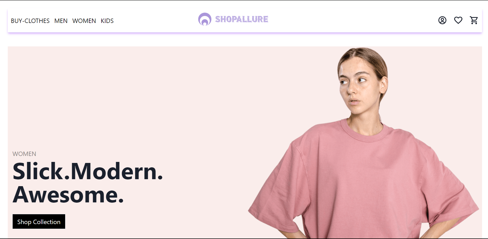

- **Trending**

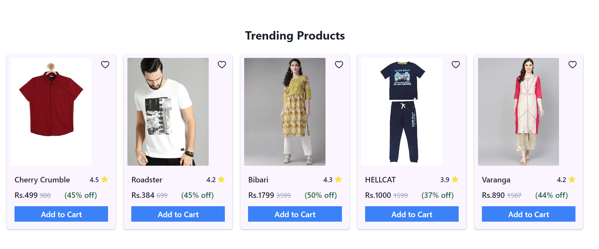

- **Product**

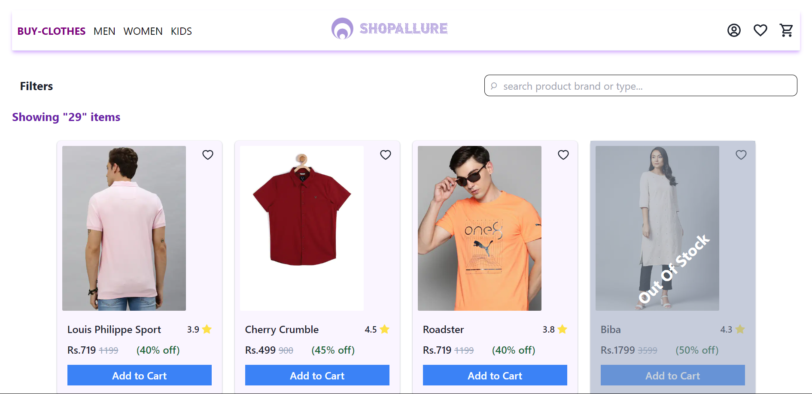

- **Product Filters**

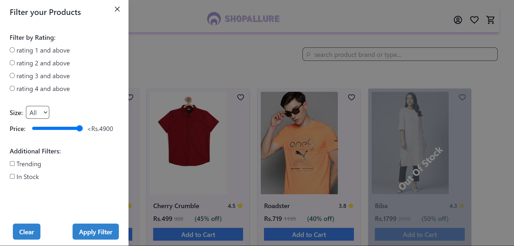

- **Login Page**

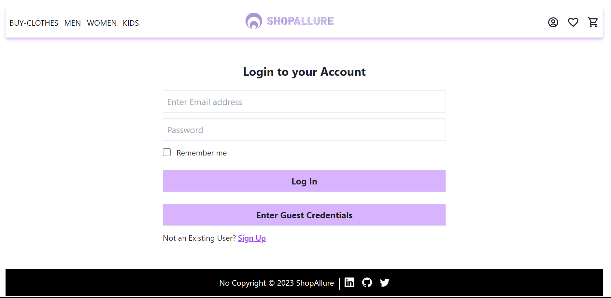

- **Profile**

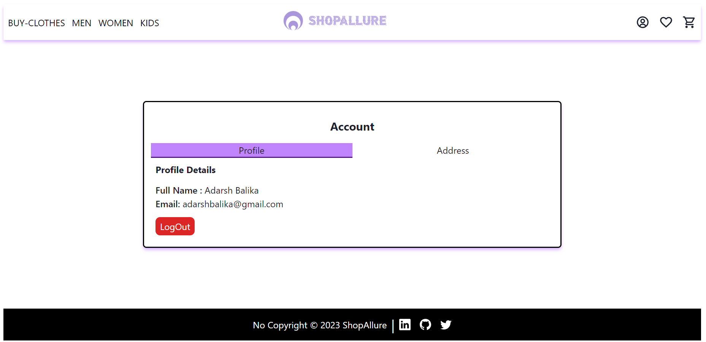

- **Address**

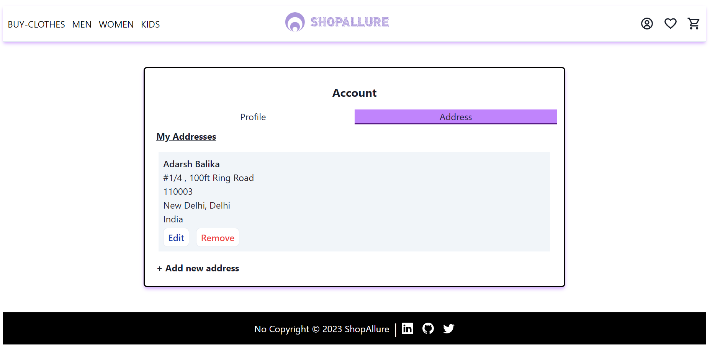

- **Wishlist Page**

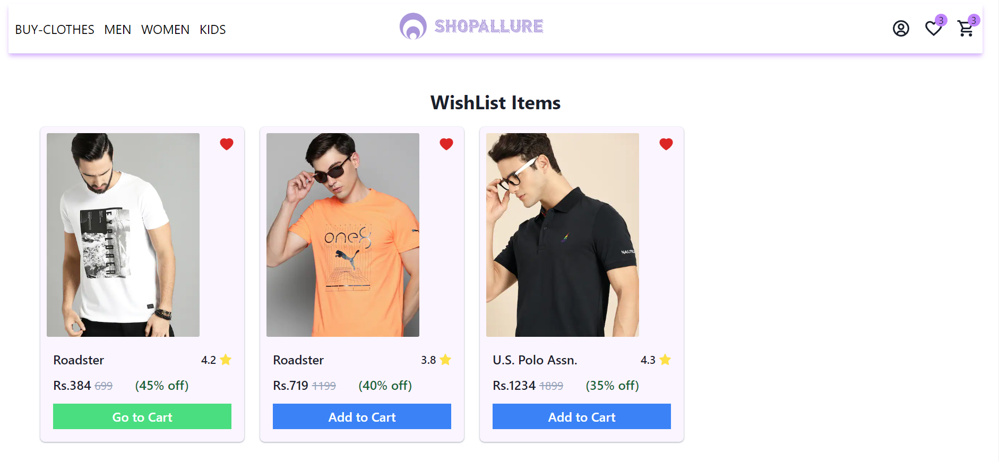

- **Cart Page**

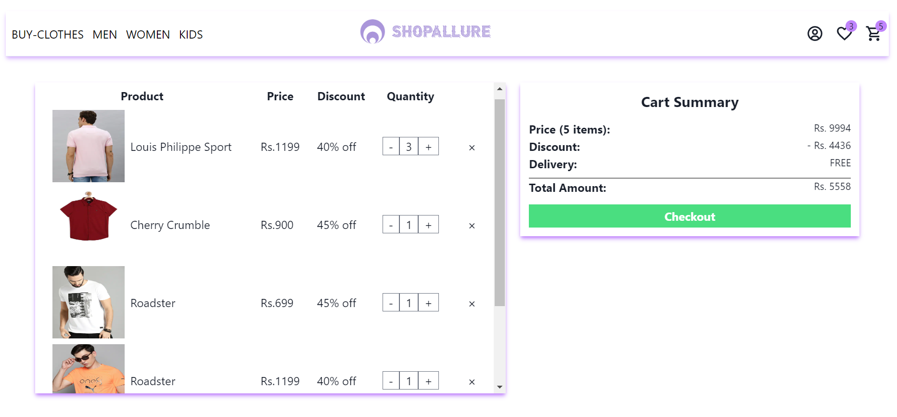

- **Checkout**

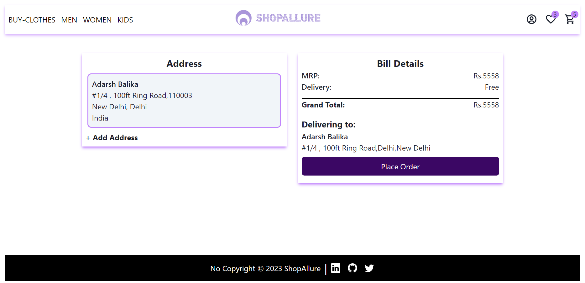

- **Payment**

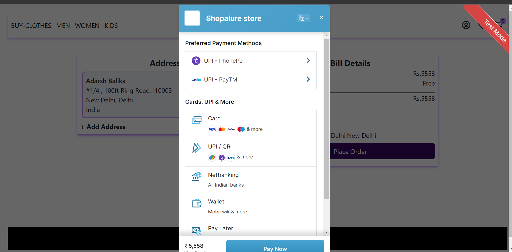
